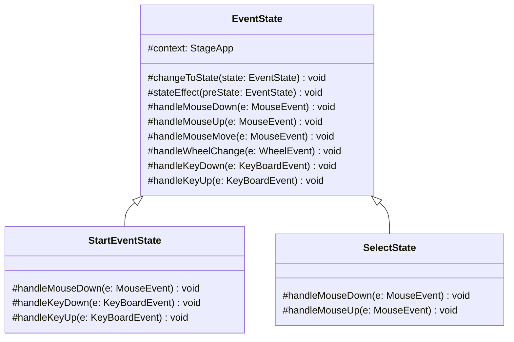
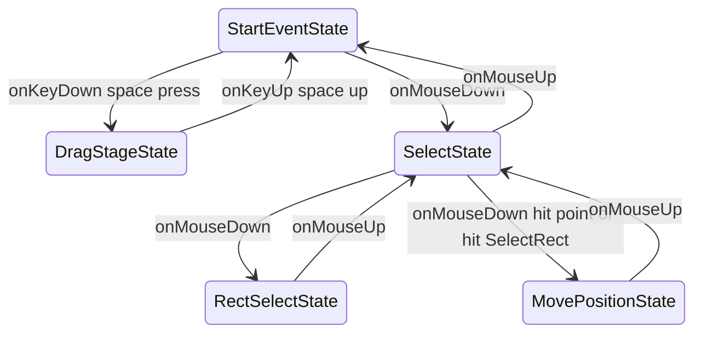

<!--
 * @Author: Chenyichen12 sama1538@outlook.com
 * @Date: 2024-03-30 11:27:24
-->

```mermaid
classDiagram
class EventState{
    #context: StageApp
    #changeToState(state: EventState) void
    #stateEffect(preState: EventState) void
    #handleMouseDown(e: MouseEvent) void
    #handleMouseUp(e: MouseEvent) void
    #handleMouseMove(e: MouseEvent) void
    #handleWheelChange(e: WheelEvent) void
    #handleKeyDown(e: KeyBoardEvent) void
    #handleKeyUp(e: KeyBoardEvent) void
}
class StartEventState{
    #handleMouseDown(e: MouseEvent) void
    #handleKeyDown(e: KeyBoardEvent) void
    #handleKeyUp(e: KeyBoardEvent) void
}
EventState <|-- StartEventState

class SelectState{
    #handleMouseDown(e: MouseEvent) void
    #handleMouseUp(e: MouseEvent) void

}
EventState<|--SelectState
```

```mermaid
stateDiagram-v2
StartEventState-->DragStageState: onKeyDown space press
DragStageState-->StartEventState: onKeyUp space up
StartEventState-->SelectState: onMouseDown 
SelectState-->StartEventState: onMouseUp
SelectState-->RectSelectState: onMouseDown
RectSelectState-->SelectState: onMouseUp
SelectState-->MovePositionState: onMouseDown hit point or hit SelectRect
MovePositionState-->SelectState: onMouseUp


```