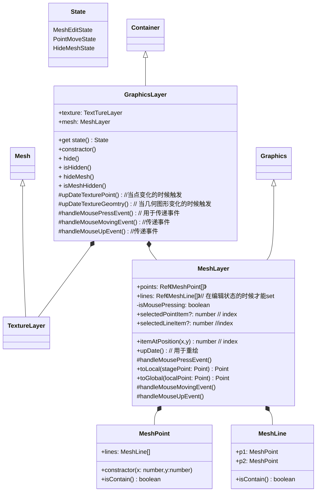

```mermaid
classDiagram 
class State{
    MeshEditState
    PointMoveState
    HideMeshState
}
class GraphicsLayer{

    
    +get state() State
    +texture: TextTureLayer
    +mesh: MeshLayer

    +constractor()

    + hide()
    + isHidden()
    + hideMesh()
    + isMeshHidden()

    #upDateTexturePoint() //当点变化的时候触发
    #upDateTextureGeomtry() // 当几何图形变化的时候触发

    #handleMousePressEvent() // 用于传递事件
    #handleMouseMovingEvent() //传递事件
    #handleMouseUpEvent() //传递事件
}

Container<|--GraphicsLayer 

class Mesh
Mesh<|--TextureLayer
GraphicsLayer *-- MeshLayer
MeshLayer *-- MeshPoint
MeshLayer *-- MeshLine
GraphicsLayer *-- TextureLayer
Graphics <|-- MeshLayer


class MeshLayer{
    +points: Ref《MeshPoint[]》
    +lines: Ref《MeshLine[]》// 在编辑状态的时候才能set
    -isMousePressing: boolean
    +itemAtPosition(x,y) number // index
    +selectedPointItem?: number // index 
    +selectedLineItem?: number //index
    +upDate() // 用于重绘    
    #handleMousePressEvent()
    +toLocal(stagePoint: Point)Point
    +toGlobal(localPoint: Point)Point
    #handleMouseMovingEvent()
    #handleMouseUpEvent()
}

class MeshPoint{
    +constractor(x: number,y:number)
    +lines: MeshLine[]
    +isContain() boolean
}

class MeshLine{
    +p1: MeshPoint
    +p2: MeshPoint
    +isContain() boolean   
}
class TextureLayer{
    
}
```